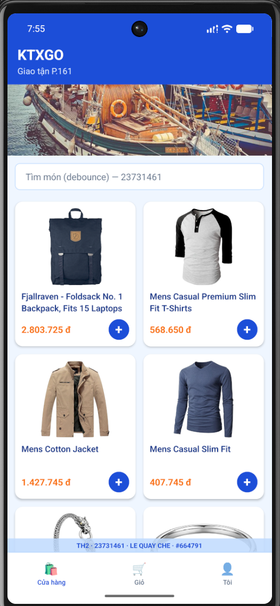
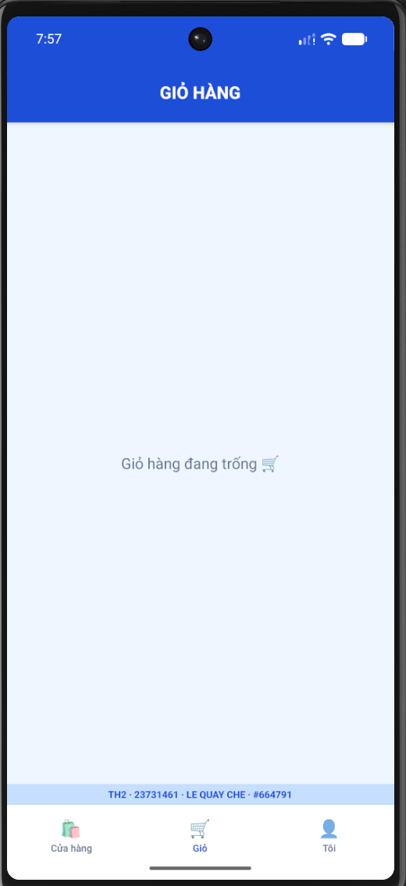
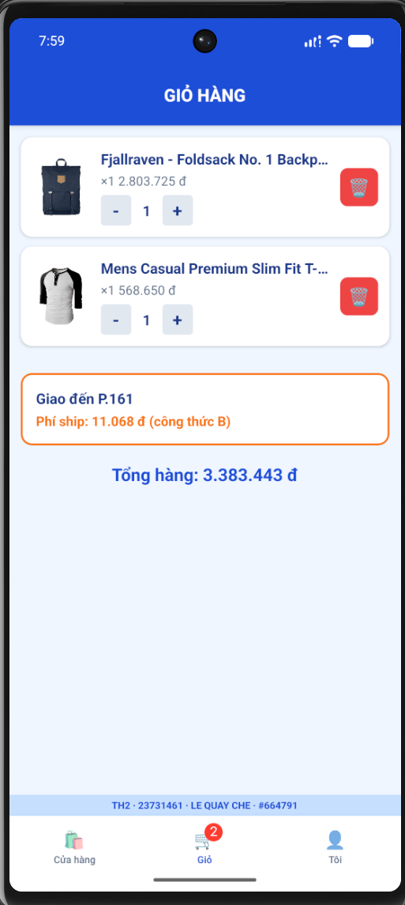

LE QUAY CHE - 23731461 - https://github.com/CheLe09062005/23731461_TH2.git - Stamp: #093856 - Last Digit: 1 - VARIANT: Watermark Bottom, Auth Phone, Tab ShopFirst, Haptic Selection, Ship Formula B, Detail Card

# KTXGo_Demo - Bài Kiểm Tra Thực Hành 2 (TH2)

## Thông Tin Sinh Viên

- **Họ và tên:** LE QUAY CHE
- **MSSV:** 23731461
- **Mã Stamp:** #664791
- **Chữ số cuối MSSV:** 1

## Cấu Hình Biến Thể (VARIANT - Số cuối = 1)

- **Vị trí Watermark:** Phía dưới (`watermarkAtTop: false`)
- **Ô Đăng nhập:** Số điện thoại (`authField: 'phone'`)
- **Thứ tự Tab:** Cửa hàng → Giỏ → Tôi (`tabOrder: 'shopFirst'`)
- **Kiểu Rung (Haptic):** `selection`
- **Công thức Phí Ship:** Công thức B
- **Kiểu Chi tiết:** Dạng Thẻ (`detailPresentation: 'card'`)

---

## Hình Ảnh Minh Chứng Minh Hoạ

### 1. Màn hình Cửa hàng (Home)



### 2. Màn hình Giỏ hàng (Cart)




---

## Hướng Dẫn Khởi Chạy Project

```bash
# 1. Cài đặt thư viện
npm install

# 2. Khởi động Metro Bundler
npm start

# 3. Chạy ứng dụng trên Android
npm run android
```
